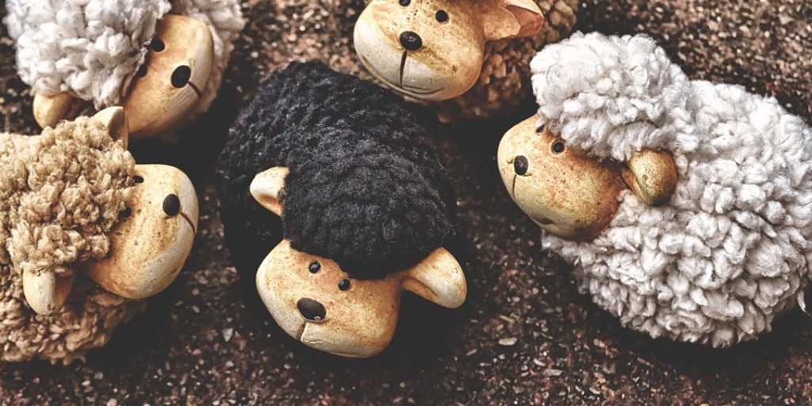

#### Background
When I was young, I felt very fortunate. Growing up in a rural New England seacoast town gave me many opportunities which I'm realizing as an adult, many other parts of the country didn't have available. A hockey rink and indoor swimming pools were less than 5 miles from my childhood home. We had woods which enabled a young boy's imagination to run wild. One day I could running from bandits, the next I could be tarzan climbing trees, or even attempting to catch a pet deer. I literally felt like the sky was the limit. 

Now, I'm in my mid-thirties, and I haven't spoken to my parents in over a year. I ask myself nearly daily, "How did we get here?"
How did my relationship with my parents become so broken? 

> Written with [StackEdit](https://stackedit.io/).
<!--stackedit_data:
eyJoaXN0b3J5IjpbMzg5MTYwNTMxLDM0NjEzMTg2NywzMjIyNz
M2MTksOTc5ODcwNzIzLC0xMjgwNjA2NDM3LC03NTAyMTMyOTMs
MTMyMDE1NDM4NCwtMTM5ODIzMjFdfQ==
-->
