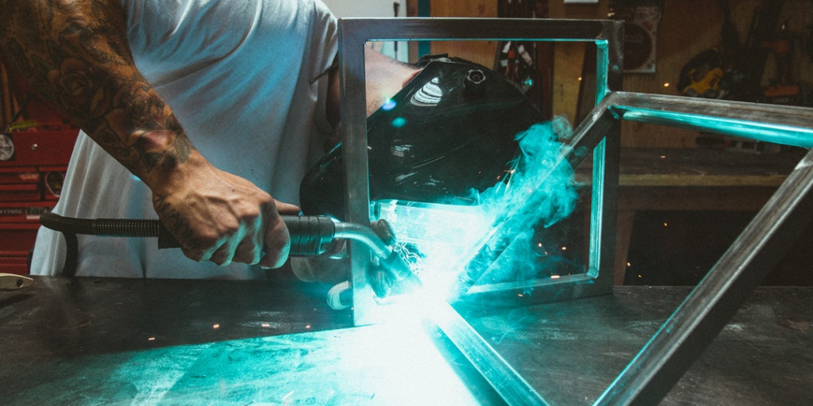

# How DarinLevesque.com was made

## 

This site was built with GatsbyJS and has been adapted from [Greg Lobinski’s](https://greglobinski.com) [PersonalBlog](https://github.com/greglobinski/gatsby-starter-personal-blog) v2 starter. Some enhancements on top of Greg’s already amazing setup were added for personal customization purposes.